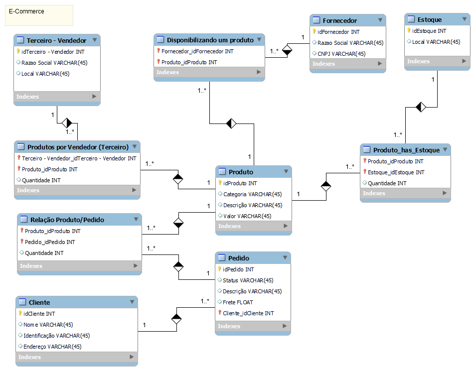
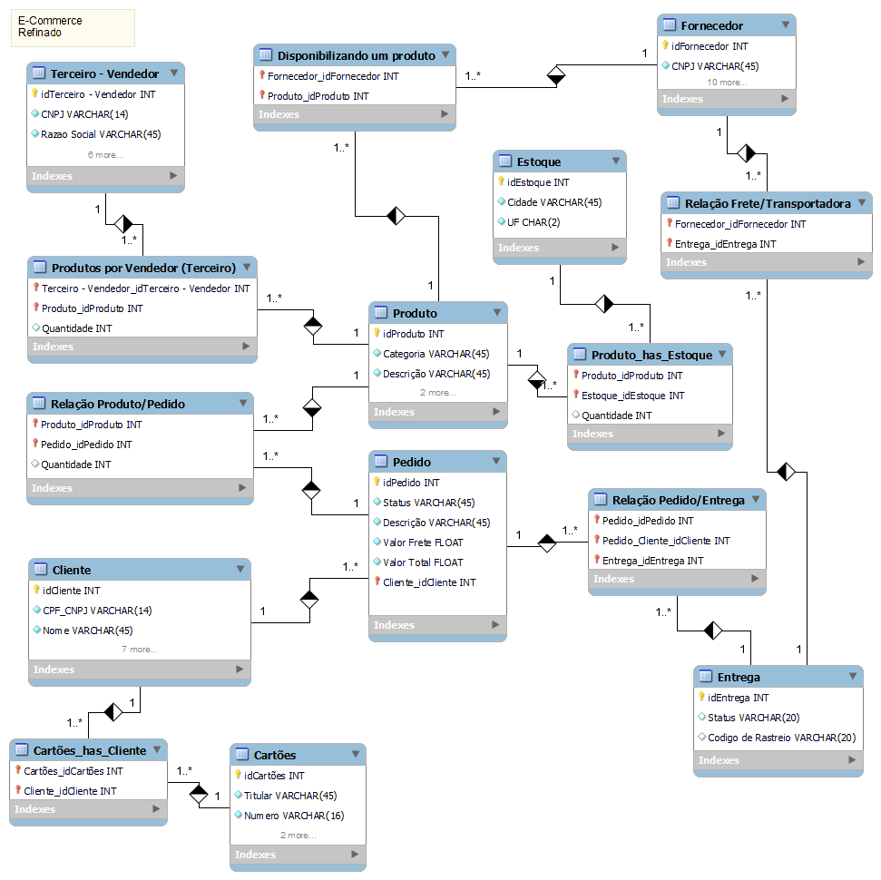

# DIO - Formação SQL Specialist

Repositório com a resolução do Desafio: Refine o Modelo de Ecommerce.

## Objetivos:

Refine o modelo apresentado acrescentando os seguintes pontos:

   * Cliente PJ e PF – Uma conta pode ser PJ ou PF, mas não pode ter as duas informações;
   * Pagamento – Pode ter cadastrado mais de uma forma de pagamento;
   * Entrega – Possui status e código de rastreio;

Modelo Fornecido:

Resolução:

