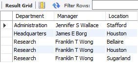
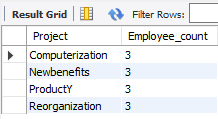
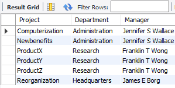
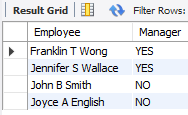
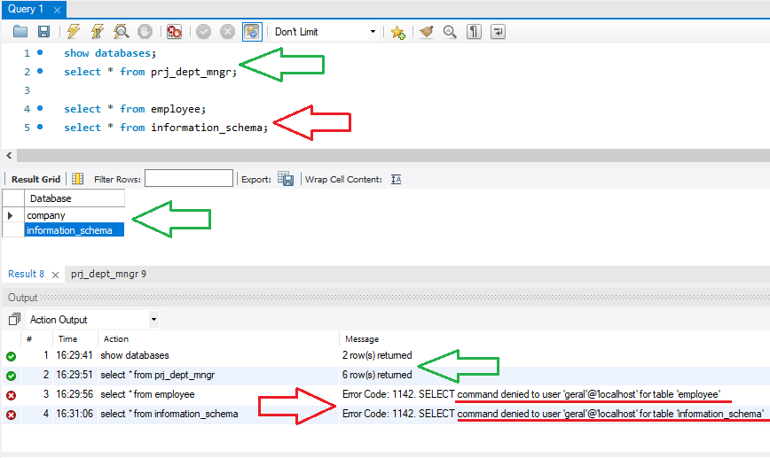
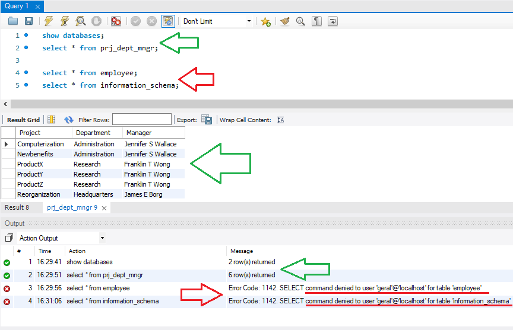

# DIO - SQL DATABASE SPECIALIST

***Repositório com a resolução do Desafio de Projeto Nº 4: Personalizando Acessos e Automatizando ações no MySQL***

## Objetivos:

**Parte 1 – Personalizando acessos com views para o cenário de Company**

Neste desafio você irá criar visões para os seguintes cenários:

    • Número de empregados por departamento e localidade 
    • Lista de departamentos e seus gerentes 
    • Projetos com maior número de empregados (ex: por ordenação desc) 
    • Lista de projetos, departamentos e gerentes 
    • Quais empregados possuem dependentes e se são gerentes 
 

Definir permissões de acesso as views de acordo com o tipo de conta de usuário. 

Criar um usuário gerente que terá acesso as informações de employee e departamento. 
Contudo, employee não terá acesso as informações relacionadas aos departamentos ou gerentes. 

**Parte 2 – Criando gatilhos para cenário de e-commerce**

Sabemos que a criação de triggers está associadas a ações que podem ser tomadas em momento anterior ou posterior a inserção, ou atualização dos dados. Além disso, em casos de remoção podemos utilizar as triggers. Sendo assim, crie as seguintes triggers para o cenário de e-commerce. 

Entregável: 

    • Triggers de remoção: before delete 
    • Triggers de atualização: before update 
 
CODE 2:
Remoção  
Usuários podem excluir suas contas por algum motivo. Dessa forma, para não perder as informações sobre estes usuários, crie um gatilho before remove 

CODE 3:
Atualização  
Inserção de novos colaboradores e atualização do salário base. 

## **Resolução - Parte 1:**

**Personalizando acessos com Views**

• Número de empregados por departamento e localidade

• Lista de departamentos e seus gerentes

• Projetos com maior número de empregados

• Lista de projetos, departamentos e gerentes

• Quais empregados possuem dependentes e se são gerentes

**Definição de permissões de acesso as Views e ao Banco de Dados**

• Usuário Geral: Concedido acesso somente a View "prj_dept_mngr"

• Usuário Manager: Concedido acesso irrestrito ao banco Company

## **Resolução - Parte 2:**

**Automatizando ações com Triggers**

## Source Files:
  

