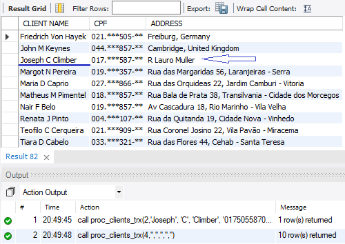

# DIO - SQL DATABASE SPECIALIST

***Repositório com a resolução do Desafio de Projeto Nº 5: Criando Transações, executando Backup e Recovery de Banco de Dados***

## Objetivos:

**Parte 1 – Transações de Banco de Dados.**

Neste desafio você irá utilizar transações para executar modificações na base de dados.

Entregável:

    • Executar statements de consultas e modificações de dados persistidos no banco de dados via transações
    

**Parte 2 – Transações de Banco de Dados com procedure.**

Neste desafio você irá criar um exemplo de transação com procedure.

Entregável: 

    • Procedure deve ter variáveis que receberão valores dos atributos e parâmetro para escolha da ação (inserção, modificação ou sair).
    • Defina uma estrutura condicional para cada ação a ser executada.
    • Implementar a verificação de erro, acarretando em um ROLLBACK total ou parcial (SAVEPOINT).
  
**Parte 3 – Backup & Recovery de Banco de Dados.**

Neste desafio você realizará o backup e recovery do banco de dados.

Entregável: 

    • Utilize o mysqdump para realizar o backup e recovery do banco de dados e-commerce.
    • Realize o backup de diferentes bancos de dados e insira os recursos como procedures, eventos e outros.
    • Adicione o arquivo de backup ao github juntamente com o script

## **Resolução:**

**Parte 1 – Transações de Banco de Dados.**

**Parte 2 – Transações de Banco de Dados com procedures.**

• Tabela de Clientes antes das alterações da Procedure.

• Inserção de dados na tabela de Clientes.

• Consulta de dados persistidos na tabela de Clientes.

• Alteração de dados na tabela de Clientes via Transaction com procedures.

• Consulta de dados persistidos após alteração na tabela de Clientes.

• Verificação de erro após inserção de dados duplicados de Cliente(CPF).

**Parte 3 – Backup & Recovery de Banco de Dados.**

• Backup do banco de dados ecommerce com mysqdump. 

• Backup do banco de dados company com os recursos: procedures, triggers e outros com mysqldump. 

## Source Files:
  

