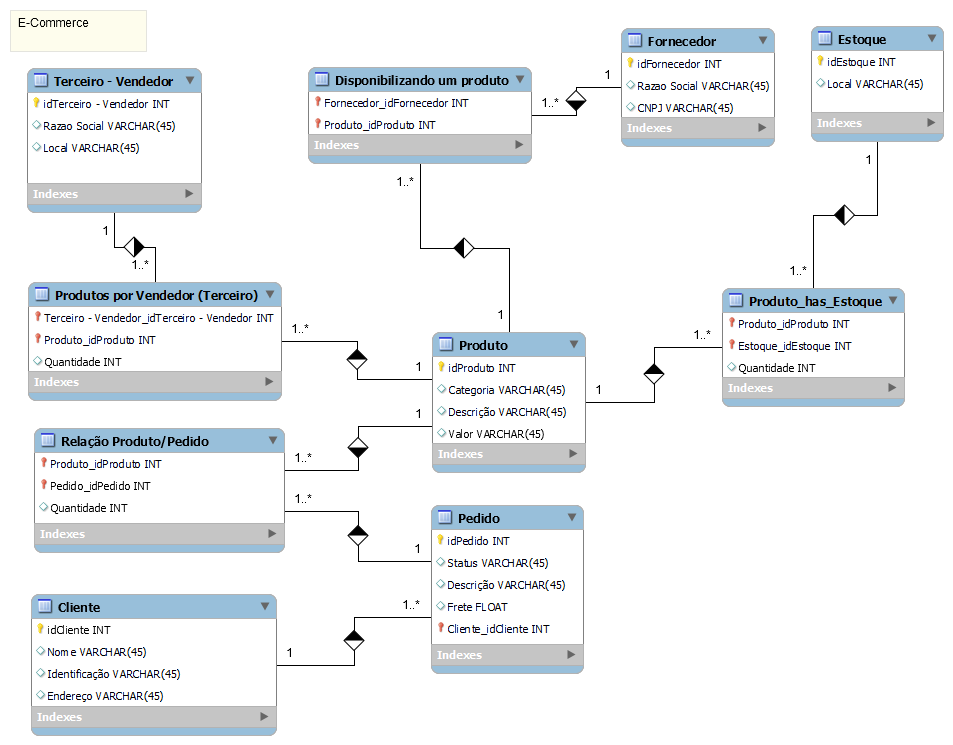
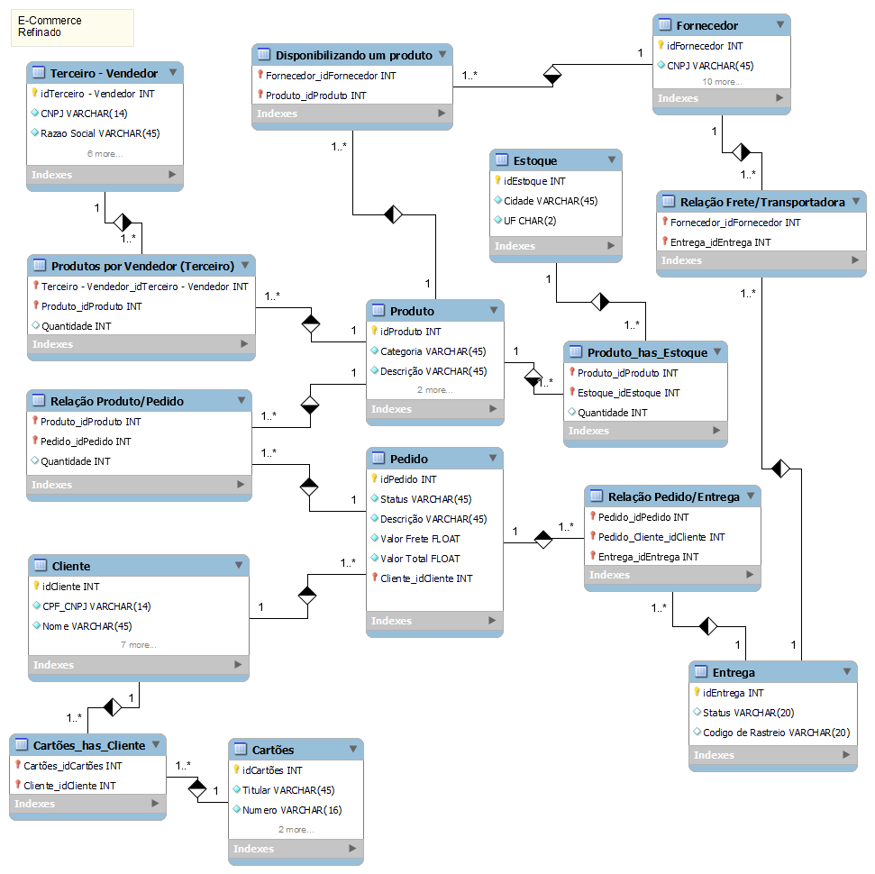

# DIO - Formação SQL Specialist

Repositório com as resoluções dos desafios de projeto e desafios de código da formação SQL Specialist da Digital Inovation One - DIO.

## Sobre:

Detalhes da formação

Desenvolva suas habilidades com banco de dados, aprenda como modelar uma base de dados de acordo com necessidades de negócios, aprenda a trabalhar com comandos Data Manipulation Language (DML) e Data Definition Language (DDL) para consultar e manipular seus dados. Crie projetos de soluções baseadas nas boas práticas das regras formais e explore técnicas de Recuperação e Controle de Concorrência em Banco de dados.

⚠️Pré-requisitos: Conhecimentos básicos em Lógica de Programação e Pensamento Computacional são muito bem-vindos!

Atividades:

* Desafio de Código: Coloque em prática todo o conhecimento adquirido nas aulas e teste o seu conhecimento na resolução de um desafio.
* Desafio de Projeto: Construa o seu portfólio construindo projetos práticos com o conhecimento adquirido ao longo das aulas.

## Desafio 1

Objetivo:
Refine o modelo apresentado acrescentando os seguintes pontos:

   * Cliente PJ e PF – Uma conta pode ser PJ ou PF, mas não pode ter as duas informações;
   * Pagamento – Pode ter cadastrado mais de uma forma de pagamento;
   * Entrega – Possui status e código de rastreio;

Modelo Fornecido:

Resolução:

  

## Desafio 2

Criar um esquema conceitual do zero. 
A partir da narrativa fornecida criar todas as entidades, relacionamentos e atributos. Caso encontre algo que não foi definido na narrativa, utilize a sua compreensão do contexto e deixe uma descrição no README do seu github para verificação.

O esquema deverá ser adicionado ao repositório do Github para futura avaliação do desafio de projeto.
Adicione ao Readme a descrição do projeto conceitual para fornecer o contexto sobre seu esquema.

Narrativa:

  * Sistema de controle e gerenciamento de execução de ordens de serviço em uma oficina mecânica
  * Clientes levam veículos à oficina mecânica para serem consertados ou para passarem por revisões periódicas
  * Cada veículo é designado a uma equipe de mecânicos que identifica os serviços a serem executados e preenche uma OS com data de entrega.
  * A partir da OS, calcula-se o valor de cada serviço, consultando-se uma tabela de referência de mão-de-obra
  * O valor de cada peça também irá compor a OS
  * O cliente autoriza a execução dos serviços
  * A mesma equipe avalia e executa os serviços
  * Os mecânicos possuem código, nome, endereço e especialidade
  * Cada OS possui: n°, data de emissão, um valor, status e uma data para conclusão dos trabalhos.
